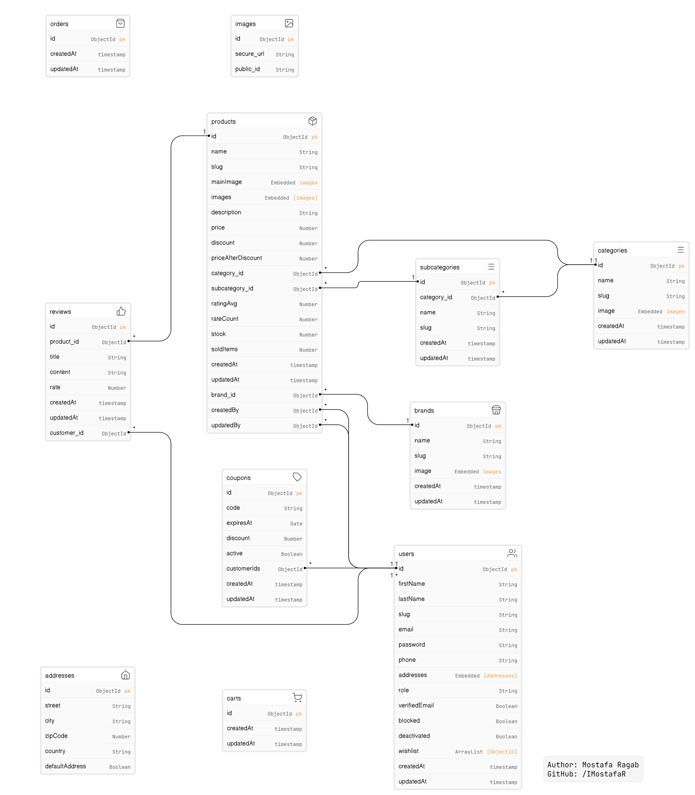

# E-commerce App with Express.js, Mongoose, and MongoDB

 

# Table of Contents

1. [Introduction](#introduction)
2. [Project Requirements](#project-requirements)
3. [Database Analysis](#database-analysis)

4. [Author](#author)

# Introduction

This is my work during learning backend web development.

This is an e-commerce-Node.js application built with Express.js, Mongoose, and MongoDB, following the MVC (Model-View-Controller) design pattern.

---

# Project Requirements

1. **User Accounts**: Enable users to create accounts and log in to the platform.

2. **Contact Information**: Allow users to store personal details like their name, email, and phone number.

3. **Address Management**: Provide users with the ability to add multiple addresses to their account.

4. **Payment Methods**: Enable users to add and manage multiple payment methods.

5. **Product Catalog**: Develop a system capable of handling a wide range of products.

6. **Categorization**: Implement a category structure for products, allowing items to belong to one or more categories.

7. **Inventory Tracking**: Keep track of product availability by monitoring stock levels.

8. **Shopping Cart**: Facilitate users' shopping experience by letting them add items to a cart. Carts can be saved for logged-in users.

9. **Order Placement**: Require users to provide both payment and address details when placing an order.

10. **Shipping Options**: Provide users with a selection of shipping methods, each associated with a fixed price.

11. **Order Progress**: Implement an order processing system with stages such as order processing, delivery in progress, and order delivered.

12. **Customer Reviews**: Allow users to leave reviews for purchased products, including a rating and written feedback.

13. **Promotions**: Enable the platform to run promotions, allowing discounts on specific product categories.

---

# Database Analysis

1. Image:

   - \_id => ObjectId (Automatically generated primary key)
   - secure_url => String
   - public_id => String

2. Category:

   - \_id => ObjectId (Automatically generated primary key)
   - name => String
   - slug => String
   - image => Embedded Image document

3. Subcategory:

   - \_id => ObjectId (Automatically generated primary key)
   - name => String
   - slug => String
   - category_id: ObjectId (Reference to Category)

4. Brand:

   - \_id => ObjectId (Automatically generated primary key)
   - name => String
   - slug => String
   - image => Embedded Image document

5. Product:

   - \_id => ObjectId (Automatically generated primary key)
   - name => String
   - slug => String
   - mainImage => Embedded Image document
   - images => [Embedded Image documents]
   - description => String
   - price => Number
   - discount => Number
   - priceAfterDiscount => Number
   - ratingAvg => Number
   - rateCount => Number
   - stock => Number
   - soldItems => Number
   - category_id: ObjectId (Reference to Category)
   - subcategory_id: ObjectId (Reference to Subcategory)
   - brand_id: ObjectId (Reference to Brand)
   - createdBy: ObjectId (Reference to User)
   - updatedBy: ObjectId (Reference to User)

6. Review:

   - \_id => ObjectId (Automatically generated primary key)
   - title => String
   - content => String
   - rate => Number
   - product_id: ObjectId (Reference to Product)
   - customer_id: ObjectId (Reference to User)

7. Address:

   - \_id => ObjectId (Automatically generated primary key)
   - street => String
   - city => String
   - zipCode => Number
   - country => String
   - defaultAddress => Boolean

8. User:

   - \_id => ObjectId (Automatically generated primary key)
   - firstName => String
   - lastName => String
   - slug => String
   - email => String
   - password => String
   - phone => String
   - addresses: [Embedded Address documents]
   - role => String
   - verifiedEmail => Boolean
   - blocked => Boolean
   - deactivated => Boolean
   - wishlist: [ObjectID] (References to Products)

9. Cart:

   - \_id => ObjectId (Automatically generated primary key)
     **More attributes will be added later**

10. Coupon:

    - \_id => ObjectId (Automatically generated primary key)
    - code => String
    - expiresAt => Date
    - discount => Number
    - active => Boolean
    - customerIds: [ObjectID] (References to Users)

11. Order:

    - \_id => ObjectId (Automatically generated primary key)
      **More attributes will be added later**

---

## Author

- GitHub - [IMostafaR](https://github.com/IMostafaR)
- Linkedin - [@imostafarh](https://www.linkedin.com/in/imostafarh/)
